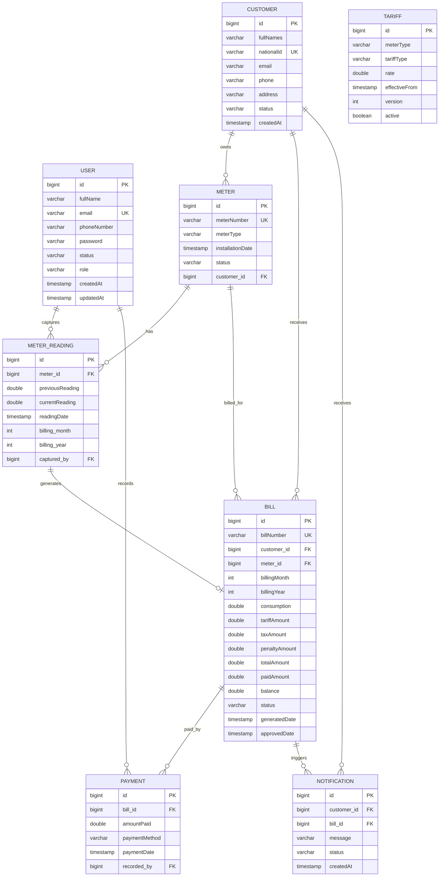

# Entity Relationship Diagram

```mermaid
erDiagram
    USER ||--o{ METER_READING : captures
    USER ||--o{ PAYMENT : records
    CUSTOMER ||--o{ METER : owns
    CUSTOMER ||--o{ BILL : receives
    CUSTOMER ||--o{ NOTIFICATION : receives
    METER ||--o{ METER_READING : has
    METER ||--o{ BILL : billed_for
    METER_READING ||--o| BILL : generates
    BILL ||--o{ PAYMENT : paid_by
    BILL ||--o{ NOTIFICATION : triggers

    USER {
        bigint id PK
        varchar fullName
        varchar email UK
        varchar phoneNumber
        varchar password
        varchar status
        varchar role
        timestamp createdAt
        timestamp updatedAt
    }

    CUSTOMER {
        bigint id PK
        varchar fullNames
        varchar nationalId UK
        varchar email
        varchar phone
        varchar address
        varchar status
        timestamp createdAt
    }

    METER {
        bigint id PK
        varchar meterNumber UK
        varchar meterType
        timestamp installationDate
        varchar status
        bigint customer_id FK
    }

    METER_READING {
        bigint id PK
        bigint meter_id FK
        double previousReading
        double currentReading
        timestamp readingDate
        int billing_month
        int billing_year
        bigint captured_by FK
    }

    TARIFF {
        bigint id PK
        varchar meterType
        varchar tariffType
        double rate
        timestamp effectiveFrom
        int version
        boolean active
    }

    BILL {
        bigint id PK
        varchar billNumber UK
        bigint customer_id FK
        bigint meter_id FK
        int billingMonth
        int billingYear
        double consumption
        double tariffAmount
        double taxAmount
        double penaltyAmount
        double totalAmount
        double paidAmount
        double balance
        varchar status
        timestamp generatedDate
        timestamp approvedDate
    }

    PAYMENT {
        bigint id PK
        bigint bill_id FK
        double amountPaid
        varchar paymentMethod
        timestamp paymentDate
        bigint recorded_by FK
    }

    NOTIFICATION {
        bigint id PK
        bigint customer_id FK
        bigint bill_id FK
        varchar message
        varchar status
        timestamp createdAt
    }
```
