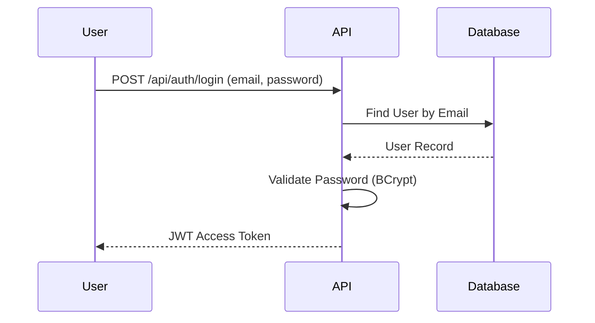
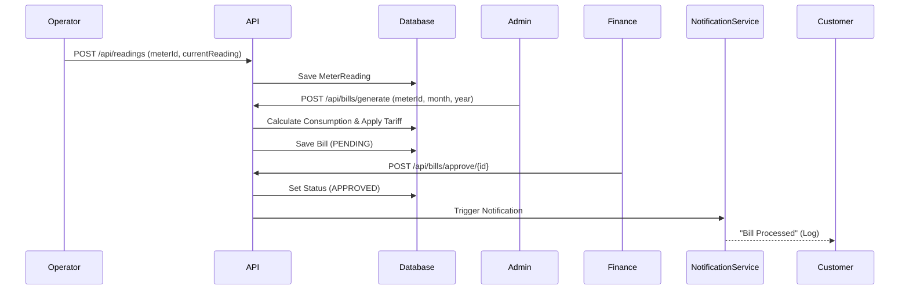
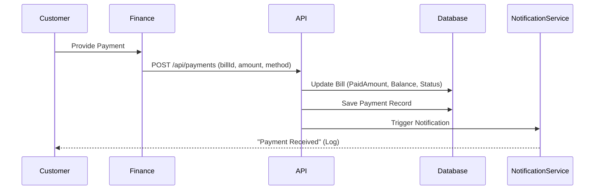
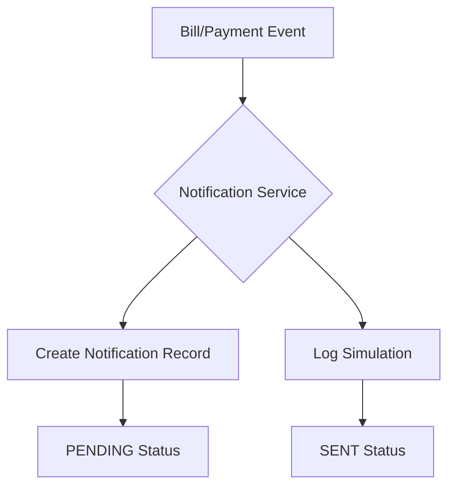

# System Flow Documentation

## Authentication Flow

```mermaid
sequenceDiagram
    User->>API: POST /api/auth/login (email, password)
    API->>Database: Find User by Email
    Database-->>API: User Record
    API->>API: Validate Password (BCrypt)
    API-->>User: JWT Access Token
```

## Billing Flow

```mermaid
sequenceDiagram
    Operator->>API: POST /api/readings (meterId, currentReading)
    API->>Database: Save MeterReading
    Admin->>API: POST /api/bills/generate (meterId, month, year)
    API->>Database: Calculate Consumption & Apply Tariff
    API->>Database: Save Bill (PENDING)
    Finance->>API: POST /api/bills/approve/{id}
    API->>Database: Set Status (APPROVED)
    API->>NotificationService: Trigger Notification
    NotificationService-->>Customer: "Bill Processed" (Log)
```

## Payment Flow

```mermaid
sequenceDiagram
    Customer->>Finance: Provide Payment
    Finance->>API: POST /api/payments (billId, amount, method)
    API->>Database: Update Bill (PaidAmount, Balance, Status)
    API->>Database: Save Payment Record
    API->>NotificationService: Trigger Notification
    NotificationService-->>Customer: "Payment Received" (Log)
```

## Notification Flow

```mermaid
graph TD
    A[Bill/Payment Event] --> B{Notification Service}
    B --> C[Create Notification Record]
    B --> D[Log Simulation]
    C --> E[PENDING Status]
    D --> F[SENT Status]
```
